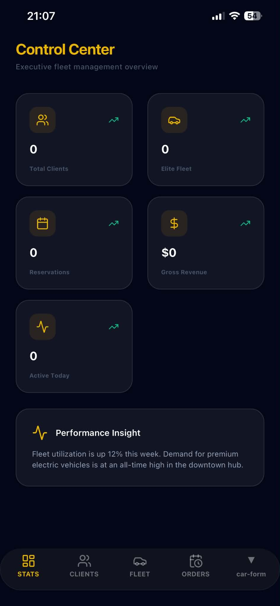
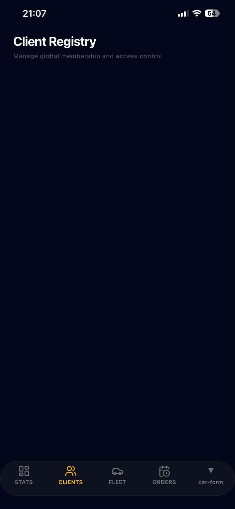
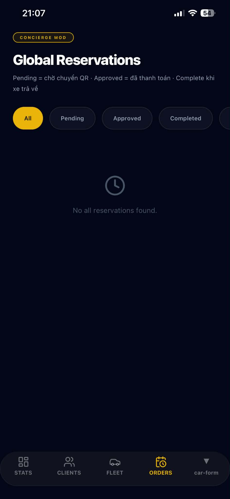
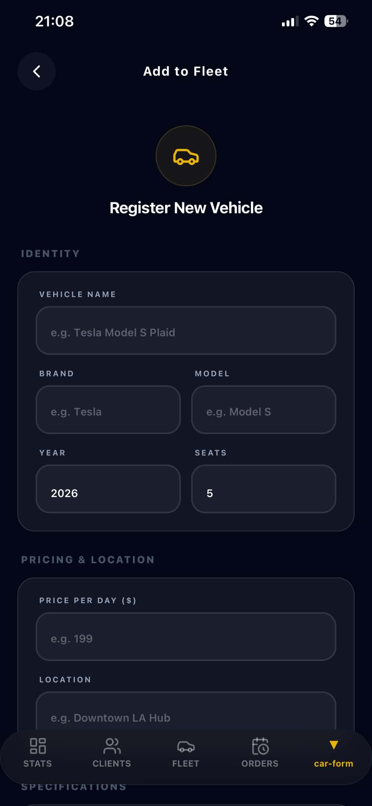

# AI Audit Log

## 1. Thông tin chung

| Thông tin | Nội dung |
|---|---|
| Môn học |  |
| Mã môn học |  |
| Lớp |  |
| Học kỳ |  |
| Tên bài tập / Project |  |
| Tên sinh viên / Nhóm |  |
| MSSV / Danh sách MSSV |  |
| Giảng viên hướng dẫn |  |
| Ngày bắt đầu |  |
| Ngày hoàn thành |  |

---

## 2. Công cụ AI đã sử dụng

Đánh dấu các công cụ AI đã sử dụng trong quá trình thực hiện bài tập/project.

- [ ] ChatGPT
- [x] Gemini
- [ ] Claude
- [ ] GitHub Copilot
- [ ] Cursor
- [ ] Antigravity
- [ ] Perplexity
- [ ] Microsoft Copilot
- [ ] Công cụ khác: ....................................

---

## 3. Mục tiêu sử dụng AI

Mô tả ngắn gọn sinh viên/nhóm đã sử dụng AI để hỗ trợ những công việc nào.

Ví dụ:

- Phân tích yêu cầu bài toán
- Gợi ý ý tưởng giải pháp
- Thiết kế database
- Thiết kế giao diện
- Viết code mẫu
- Debug lỗi
- Tối ưu code
- Viết test case
- Kiểm tra bảo mật
- Viết báo cáo
- Chuẩn bị slide thuyết trình
- Tìm hiểu công nghệ mới

### Mô tả mục tiêu sử dụng AI

```text
Nhóm đã sử dụng AI (ChatGPT/Gemini) với mục tiêu tối ưu hóa thời gian xây dựng giao diện (Frontend) cho phân hệ Admin. Cụ thể:

Phân tích cấu trúc thiết kế (Design System), màu sắc, component có sẵn từ phía Client (màn hình người dùng) để áp dụng đồng bộ sang trang Admin.

Sinh code giao diện nhanh cho 5 màn hình quản trị bao gồm: Bảng điều khiển (Dashboard), Quản lý đặt xe (Booking), Quản lý danh sách xe (Cars), Form thêm/sửa xe (CarForm), và Quản lý người dùng (Users).

Tạo dữ liệu giả lập (Mock data) có cấu trúc chuẩn để test giao diện trước khi kết nối API backend.

## 4. Nhật ký sử dụng AI chi tiết

> Mỗi lần sử dụng AI cho một phần quan trọng của bài tập/project, sinh viên cần ghi lại theo mẫu bên dưới.  
> Sinh viên/nhóm có thể nhân bản mẫu “Lần sử dụng AI” nhiều lần tùy theo số lần sử dụng AI thực tế.

---
### Lần sử dụng AI số 0

| Nội dung | Thông tin |
|---|---|
| Ngày sử dụng |  |
| Công cụ AI | ChatGPT / Gemini / Claude / GitHub Copilot / Cursor / Antigravity / Khác |
| Mục đích sử dụng |  |
| Phần việc liên quan | Requirement / Design / Database / Frontend / Backend / Testing / Debug / Report / Presentation / Other |
| Mức độ sử dụng | Hỗ trợ ý tưởng / Hỗ trợ một phần / Hỗ trợ nhiều / Sinh chính nội dung |

### Lần sử dụng AI số 1

| Nội dung | Thông tin |
|---|---|
| Ngày sử dụng | 15/05/2026 |
| Công cụ AI |  Gemini |
| Mục đích sử dụng |  | Phân tích UI cũ và sinh màn hình AdminDashboard đầu tiên
| Phần việc liên quan | Frontend / Design |
| Mức độ sử dụng | AI sinh chính |

#### 4.1. Prompt đã sử dụng

```text
Promt 
Ngày 1 :
-DE180004 - Nguyễn Tiến Dũng
Bạn là một Frontend Developer chuyên nghiệp với thế mạnh về UI/UX và thiết kế hệ thống (Design System). Tôi đang phát triển một hệ thống quản lý và cần bạn giúp xây dựng các trang Admin.

Nhiệm vụ của bạn là dựa vào cấu trúc code và thiết kế giao diện (UI) của các màn hình tôi cung cấp dưới đây, hãy viết code cho 5 trang Admin mới bao gồm:
1. AdminBooking (Quản lý danh sách đặt xe)
2. AdminCarForm (Form thêm/sửa thông tin xe)
3. AdminCars (Danh sách quản lý xe)
4. AdminDashboard (Bảng điều khiển tổng quan với các thống kê)
5. AdminUsersScreen (Quản lý danh sách người dùng)

YÊU CẦU BẮT BUỘC (CRITICAL):
- [GIỮ NGUYÊN UI DESIGN]: Bạn phải phân tích kỹ các class CSS/Tailwind, style, font chữ, màu sắc, padding/margin, và layout từ đoạn code mẫu của tôi. Áp dụng chính xác phong cách thiết kế đó cho 5 trang mới.
- [TÁI SỬ DỤNG COMPONENT]: Nếu trong code mẫu có sẵn các component như Button, Input, Table, Card, hay Modal, hãy tái sử dụng chúng hoặc tạo các component mới có giao diện y hệt.
- [MÔ PHỎNG DỮ LIỆU]: Sử dụng dữ liệu giả (mock data) phù hợp cho từng trang (ví dụ: AdminCars cần có hình ảnh xe, tên xe, giá; AdminBooking cần có thông tin khách hàng, ngày đặt, trạng thái...).
- [CẤU TRÚC RÕ RÀNG]: Tách biệt các component nếu cần thiết để code dễ đọc và dễ bảo trì.

Dưới đây là đoạn code mẫu chứa UI hiện tại của dự án (File GlobalLayout.jsx và HomeScreen.jsx sử dụng TailwindCSS):
[Dán code file GlobalLayout.jsx với tone màu chủ đạo #MainBlue và sidebar navigation hiện tại]

Hãy bắt đầu phân tích UI từ code mẫu và tạo ra trang đầu tiên: AdminDashboard. Khi nào xong, tôi sẽ yêu cầu bạn làm tiếp các trang còn lại để tránh việc code bị cắt ngang.
```

#### 4.2. Kết quả AI gợi ý

Tóm tắt nội dung AI đã trả lời hoặc gợi ý.

```text
Ngày 1:
 DE180004 - Nguyễn Tiến Dũng
- AI phân tích thành công bảng màu của hệ thống
- AI sinh ra mã nguồn hoàn chỉnh cho file AdminDashboard.jsx gồm 4 thẻ Card thống kê tổng số xe, số lượt đặt, doanh thu, người dùng mới kèm theo một table danh sách các giao dịch gần đây.
- Sử dụng các class TailwindCSS khớp 95% với cấu trúc layout được cung cấp.
```

#### 4.3. Phần sinh viên/nhóm đã sử dụng từ AI

Mô tả rõ phần nào được sử dụng lại từ gợi ý của AI.

```text
Ngày 1: 
 DE180004 - Nguyễn Tiến Dũng
- Toàn bộ screen được AI gen thành công gồm 5 screen
+ AdminBooking
+ AdminCarFrom
+ AdminCars
+ AdminDashboard
+ AdminUsers
```

#### 4.4. Phần sinh viên/nhóm tự chỉnh sửa hoặc cải tiến

Mô tả sinh viên/nhóm đã thay đổi, kiểm tra, sửa lỗi hoặc cải tiến gì so với gợi ý ban đầu của AI.

```text
Ngày 1: 
```

#### 4.5. Minh chứng

| Loại minh chứng | Nội dung |
|---|---|
| Link commit |  |
| File liên quan | AdminBookingScreen.tsx, AdminCarFromScreen.tsx,AdminCarsScreen.tsx,   AdminDashboardScreen.tsx, AdminUsersSreen.tsx|
| Screenshot |   ,  , , |
| Kết quả chạy/test | Thành công |
| Link video demo |  |
| Ghi chú khác |  |

#### 4.6. Nhận xét cá nhân/nhóm

Sinh viên/nhóm học được gì sau lần sử dụng AI này?

```text
Viết tại đây...
```

---

### Lần sử dụng AI số 2

| Nội dung | Thông tin |
|---|---|
| Ngày sử dụng |  |
| Công cụ AI | ChatGPT / Gemini / Claude / GitHub Copilot / Cursor / Antigravity / Khác |
| Mục đích sử dụng |  |
| Phần việc liên quan | Requirement / Design / Database / Frontend / Backend / Testing / Debug / Report / Presentation / Other |
| Mức độ sử dụng | Hỗ trợ ý tưởng / Hỗ trợ một phần / Hỗ trợ nhiều / Sinh chính nội dung |

#### 4.1. Prompt đã sử dụng

```text
Dán nguyên văn prompt đã hỏi AI tại đây.
```

#### 4.2. Kết quả AI gợi ý

```text
Viết tại đây...
```

#### 4.3. Phần sinh viên/nhóm đã sử dụng từ AI

```text
Viết tại đây...
```

#### 4.4. Phần sinh viên/nhóm tự chỉnh sửa hoặc cải tiến

```text
Viết tại đây...
```

#### 4.5. Minh chứng

| Loại minh chứng | Nội dung |
|---|---|
| Link commit |  |
| File liên quan |  |
| Screenshot |  |
| Kết quả chạy/test |  |
| Link video demo |  |
| Ghi chú khác |  |

#### 4.6. Nhận xét cá nhân/nhóm

```text
Viết tại đây...
```

---

### Lần sử dụng AI số 3

| Nội dung | Thông tin |
|---|---|
| Ngày sử dụng |  |
| Công cụ AI | ChatGPT / Gemini / Claude / GitHub Copilot / Cursor / Antigravity / Khác |
| Mục đích sử dụng |  |
| Phần việc liên quan | Requirement / Design / Database / Frontend / Backend / Testing / Debug / Report / Presentation / Other |
| Mức độ sử dụng | Hỗ trợ ý tưởng / Hỗ trợ một phần / Hỗ trợ nhiều / Sinh chính nội dung |

#### 4.1. Prompt đã sử dụng

```text
Dán nguyên văn prompt đã hỏi AI tại đây.
```

#### 4.2. Kết quả AI gợi ý

```text
Viết tại đây...
```

#### 4.3. Phần sinh viên/nhóm đã sử dụng từ AI

```text
Viết tại đây...
```

#### 4.4. Phần sinh viên/nhóm tự chỉnh sửa hoặc cải tiến

```text
Viết tại đây...
```

#### 4.5. Minh chứng

| Loại minh chứng | Nội dung |
|---|---|
| Link commit |  |
| File liên quan |  |
| Screenshot |  |
| Kết quả chạy/test |  |
| Link video demo |  |
| Ghi chú khác |  |

#### 4.6. Nhận xét cá nhân/nhóm

```text
Viết tại đây...
```

---

## 5. Bảng tổng hợp mức độ sử dụng AI

Đánh dấu mức độ AI hỗ trợ ở từng hạng mục.

| Hạng mục | Không dùng AI | AI hỗ trợ ít | AI hỗ trợ nhiều | AI sinh chính | Ghi chú |
|---|:---:|:---:|:---:|:---:|---|
| Phân tích yêu cầu |  |  |  |  |  |
| Viết user story/use case |  |  |  |  |  |
| Thiết kế database |  |  |  |  |  |
| Thiết kế kiến trúc hệ thống |  |  |  |  |  |
| Thiết kế giao diện |  |  |  |  |  |
| Code frontend |  |  |  |  |  |
| Code backend |  |  |  |  |  |
| Debug lỗi |  |  |  |  |  |
| Viết test case |  |  |  |  |  |
| Kiểm thử sản phẩm |  |  |  |  |  |
| Tối ưu code |  |  |  |  |  |
| Viết báo cáo |  |  |  |  |  |
| Làm slide thuyết trình |  |  |  |  |  |

---

## 6. Các lỗi hoặc hạn chế từ AI

Ghi lại các trường hợp AI trả lời sai, thiếu, chưa phù hợp hoặc sinh code không chạy.

| STT | Lỗi/hạn chế từ AI | Cách phát hiện | Cách xử lý/cải tiến |
|---:|---|---|---|
| 1 |  |  |  |
| 2 |  |  |  |
| 3 |  |  |  |

---

## 7. Kiểm chứng kết quả AI

Mô tả cách sinh viên/nhóm kiểm tra lại kết quả do AI gợi ý.

Có thể bao gồm:

- Chạy thử chương trình
- Viết test case
- So sánh với yêu cầu đề bài
- Kiểm tra output
- Đối chiếu tài liệu môn học
- Hỏi lại giảng viên
- Review cùng thành viên nhóm
- Kiểm tra lỗi bảo mật
- Kiểm tra bằng dữ liệu mẫu
- So sánh trước và sau khi dùng AI

### Nội dung kiểm chứng

```text
Viết tại đây...
```

---

## 8. Đóng góp cá nhân hoặc đóng góp nhóm

### 8.1. Đối với bài cá nhân

Mô tả phần sinh viên tự làm, phần AI hỗ trợ và phần đã tự cải tiến.

```text
Viết tại đây...
```

### 8.2. Đối với bài nhóm

| Thành viên | MSSV | Nhiệm vụ chính | Có sử dụng AI không? | Minh chứng đóng góp |
|---|---|---|---|---|
|  |  |  | Có / Không |  |
|  |  |  | Có / Không |  |
|  |  |  | Có / Không |  |
|  |  |  | Có / Không |  |

---

## 9. Reflection cuối bài

### 9.1. AI đã hỗ trợ em/nhóm ở điểm nào?

```text
Viết tại đây...
```

### 9.2. Phần nào em/nhóm không sử dụng theo gợi ý của AI? Vì sao?

```text
Viết tại đây...
```

### 9.3. Em/nhóm đã kiểm tra tính đúng đắn của kết quả AI như thế nào?

```text
Viết tại đây...
```

### 9.4. Nếu không có AI, phần nào sẽ khó khăn nhất?

```text
Viết tại đây...
```

### 9.5. Sau bài tập/project này, em/nhóm học được gì về môn học?

```text
Viết tại đây...
```

### 9.6. Sau bài tập/project này, em/nhóm học được gì về cách sử dụng AI có trách nhiệm?

```text
Viết tại đây...
```

---

## 10. Cam kết học thuật

Sinh viên/nhóm cam kết rằng:

- Nội dung AI hỗ trợ đã được ghi nhận trung thực.
- Không nộp nguyên văn kết quả AI mà không kiểm tra.
- Có khả năng giải thích các phần đã nộp.
- Chịu trách nhiệm về tính đúng đắn của sản phẩm cuối cùng.
- Hiểu rằng việc sử dụng AI không khai báo có thể ảnh hưởng đến kết quả đánh giá.

| Đại diện sinh viên/nhóm | Ngày xác nhận |
|---|---|
|  |  |
